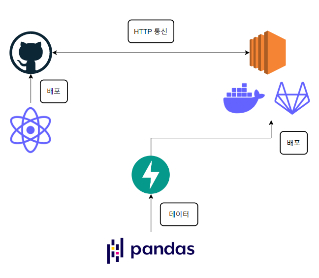

# 영화 추천 웹 서비스

## 목표
웹 서비스 개발의 전반적인 흐름을 이해하기 위한 개인 공부 목적으로, 프론트엔드, 백엔드, DevOps, 데이터 엔지니어 등을 모두 아우르는 프로젝트를 진행합니다.

### 전체 구조도

- pandas를 이용하여 영화 데이터를 처리합니다.
- FastAPI를 이용하여 API를 개발합니다.
- AWS EC2를 설정하고 그 위에 docker로 가상화를, GitLab으로 배포 자동화 환경을 구축합니다.
- React를 이용하여 프론트엔드 작업을 합니다.
- GitHub Pages로 배포합니다.

### 주요 기능

- 사용자 평점에 따른 영화 추천 결과 제공
  - 영화 데이터셋 출처: https://files.grouplens.org/datasets/movielens/ml-latest-small.zip
- 영화 랜덤 검색 결과 제공
- 영화 장르별 분류 결과 제공
- 영화 상세 결과 제공
- 영화 개인화 추천